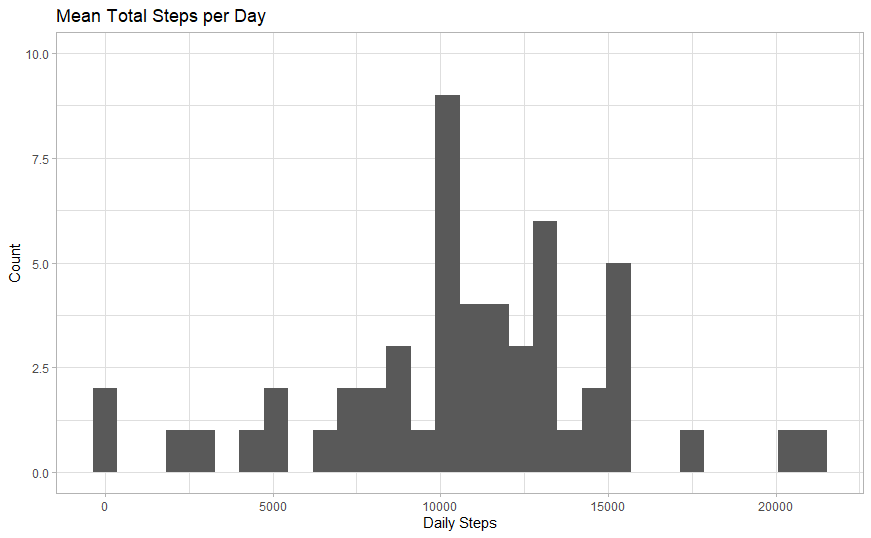
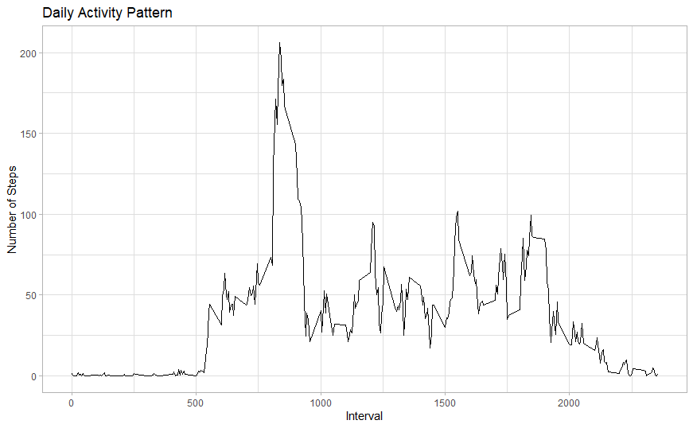
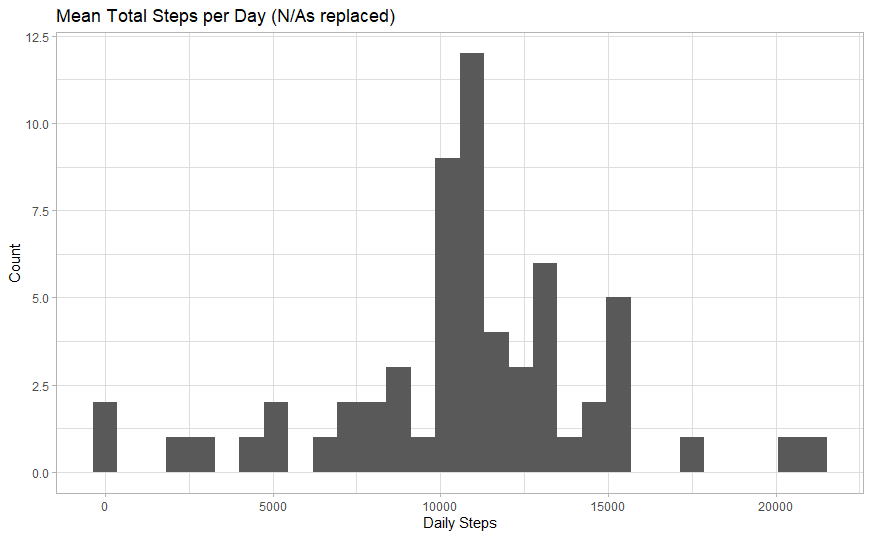
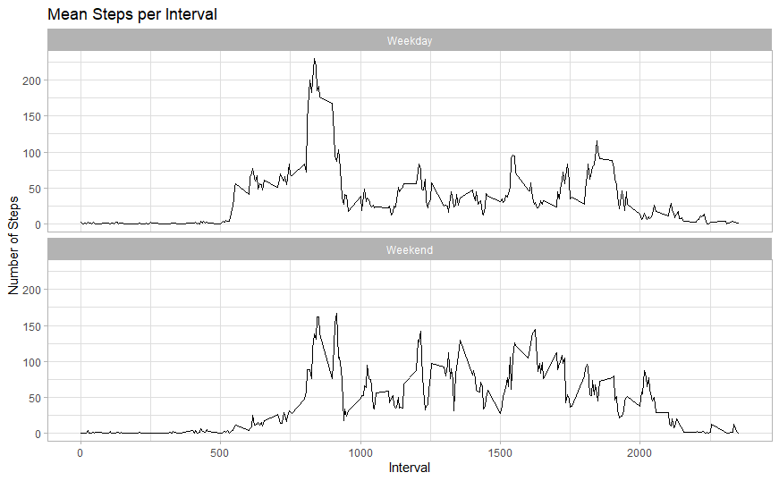

Note to marker: Issue when knitting document from rmd file to html. Output from code won't display.--\>

Hence, code is shown as text. Output displayed as figures generated in R file (available to run in Github directory if checking/proof necessary.) Thanks.

## 1. Loading and pre-processing the data

### Code:

unzip("activity.zip") activity \<- read.csv("activity.csv")

activity$date <- as.Date.POSIXct(activity$date, "%Y%m%d")

## 2. What is mean total number of steps taken per day?

### Code:

tnsteps \<- activity %\>% group_by(date) %\>% summarize(daily.steps = sum(steps))

tnsteps.plot \<- ggplot(tnsteps,aes(daily.steps),) + geom_histogram() + ylim(c(0,10)) + ggtitle("Mean Total Steps per Day ") + xlab("Daily Steps") + ylab("Count") + theme_light() + geom_bar()

daily.mean \<- mean(tnsteps$daily.steps, na.rm = T) daily.median <- median(tnsteps$daily.steps, na.rm = T)

### Results:

Plot:

Calculated Mean and Median Values:

\> daily.mean

[1] 10766.19

\>daily .median

[1] 10765

## 3. What is the average daily activity pattern?

### Code:

tnsteps.interval \<- activity %\>% group_by(interval) %\>% summarize(mean.steps = mean(steps, na.rm = T))

daily.activity.plot \<- ggplot(tnsteps.interval, aes(x = interval, y = mean.steps)) + geom_line() + ggtitle("Mean Steps per Interval") + xlab("Interval") + ylab("Number of Steps") + theme_light()

### Results:

Plot:

## 4. Imputing missing values

### Code:

sum(is.na(activity\$steps))

imputed.steps \<- activity %\>% mutate( steps = case_when(is.na(steps) \~ tnsteps.interval$mean.steps[match(activity$interval,tnsteps.interval$interval)], T ~ as.numeric(steps) )) sum(is.na(imputed.steps$steps))

total.imputed.steps \<- imputed.steps %\>% group_by(date) %\>% summarize(newdaily.steps = sum(steps))

total.imputed.steps

total.imputed.steps.plot \<- ggplot(total.imputed.steps,aes(newdaily.steps),) + geom_histogram() + ggtitle("Mean Total Steps per Day ") + xlab("Daily Steps") + ylab("Count") + theme_light() + geom_bar()

total.imputed.steps.plot

daily.mean \<- mean(total.imputed.steps$newdaily.steps, na.rm = T) daily.median <- median(total.imputed.steps$newdaily.steps, na.rm = T)

### Results:

Calculated Mean and Median Values:

\>daily.mean

[1] 10766.19

\>daily.median

[1] 10766.19

## 5. Are there differences in activity patterns between weekdays and weekends?

### Code:

imputed.steps$day <- weekdays(imputed.steps$date) imputed.steps$period <- case_when(imputed.steps$day %in% c("Monday","Tuesday","Wednesday","Thursday","Friday") \~ "Weekday", imputed.steps\$day %in% c("Saturday","Sunday") \~ "Weekend")

week.period \<- imputed.steps %\>% group_by(interval,period) %\>% summarize(wd.steps = mean(steps, na.rm = T))

week.period.plot \<- ggplot(week.period, aes(x = interval, y = wd.steps)) + geom_line() + ggtitle("Mean Steps per Interval") + xlab("Interval") + ylab("Number of Steps") + theme_light() + facet_wrap(\~period, ncol = 1, nrow = 2)

### Results:

